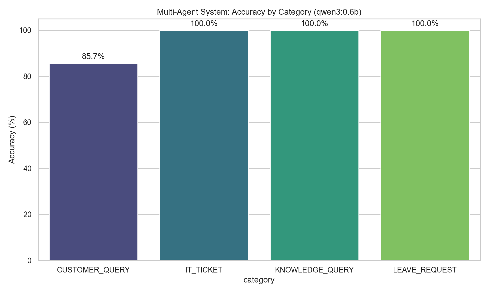
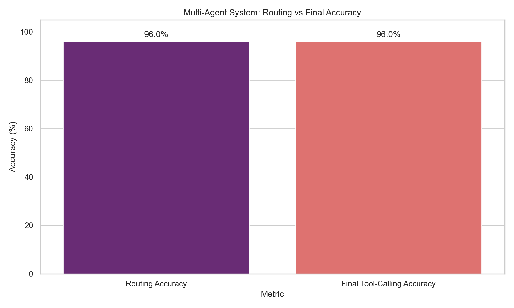
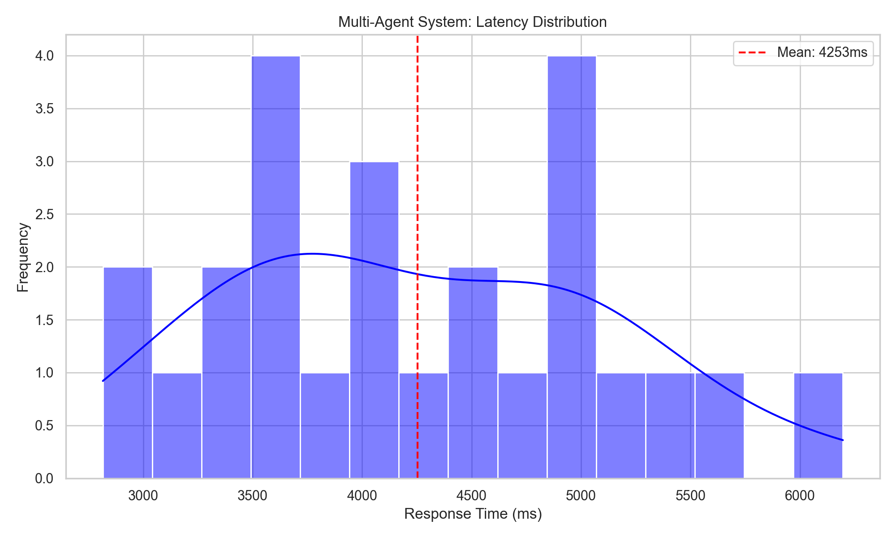

# Multi-Agent System Results (qwen3:0.6b)

Generated: 2026-04-23 23:52:23

## Architecture
- **Router Agent**: Classifies queries into 4 categories
- **Specialized Agents**: One agent per tool type
  - IT Ticket Agent
  - Leave Request Agent  
  - Customer Query Agent
  - Knowledge Agent

## Performance Analysis

## Latency Analysis

| Category        |   Count | Accuracy   |
|-----------------|---------|------------|
| CUSTOMER_QUERY  |       7 | 85.7%      |
| IT_TICKET       |       6 | 100.0%     |
| KNOWLEDGE_QUERY |       6 | 100.0%     |
| LEAVE_REQUEST   |       6 | 100.0%     |

## Error Breakdown
| Error Reason   |   Count |
|----------------|---------|
| wrong_tool     |       1 |

## Comparison with Single SLM Models

The multi-agent system typically outperforms single SLM approaches because:
1. **Reduced Cognitive Load**: Each agent only handles 1 tool type
2. **Specialized Prompts**: Domain-specific examples and rules
3. **Explicit Routing**: Router agent makes tool selection explicit
4. **Focused Training**: Smaller effective "search space" for each agent

## Detailed Results
|   ID | Category        | Tool                   | Success   | Reason     |   Time(ms) |
|------|-----------------|------------------------|-----------|------------|------------|
|    1 | IT_TICKET       | create_it_ticket       | ✓         | -          |       3348 |
|    2 | LEAVE_REQUEST   | process_leave_request  | ✓         | -          |       5540 |
|    3 | CUSTOMER_QUERY  | route_customer_query   | ✓         | -          |       4525 |
|    4 | KNOWLEDGE_QUERY | get_internal_knowledge | ✓         | -          |       2990 |
|    5 | IT_TICKET       | create_it_ticket       | ✓         | -          |       5070 |
|    6 | IT_TICKET       | create_it_ticket       | ✓         | -          |       4227 |
|    7 | IT_TICKET       | create_it_ticket       | ✓         | -          |       3097 |
|    8 | IT_TICKET       | create_it_ticket       | ✓         | -          |       3530 |
|    9 | CUSTOMER_QUERY  | route_customer_query   | ✗         | wrong_tool |       3967 |
|   10 | IT_TICKET       | create_it_ticket       | ✓         | -          |       3972 |
|   11 | LEAVE_REQUEST   | process_leave_request  | ✓         | -          |       5492 |
|   12 | LEAVE_REQUEST   | process_leave_request  | ✓         | -          |       3702 |
|   13 | LEAVE_REQUEST   | process_leave_request  | ✓         | -          |       4990 |
|   14 | LEAVE_REQUEST   | process_leave_request  | ✓         | -          |       4889 |
|   15 | LEAVE_REQUEST   | process_leave_request  | ✓         | -          |       6196 |
|   16 | CUSTOMER_QUERY  | route_customer_query   | ✓         | -          |       4954 |
|   17 | CUSTOMER_QUERY  | route_customer_query   | ✓         | -          |       3461 |
|   18 | CUSTOMER_QUERY  | route_customer_query   | ✓         | -          |       3806 |
|   19 | CUSTOMER_QUERY  | route_customer_query   | ✓         | -          |       4608 |
|   20 | CUSTOMER_QUERY  | route_customer_query   | ✓         | -          |       4955 |
|   21 | KNOWLEDGE_QUERY | get_internal_knowledge | ✓         | -          |       4078 |
|   22 | KNOWLEDGE_QUERY | get_internal_knowledge | ✓         | -          |       3640 |
|   23 | KNOWLEDGE_QUERY | get_internal_knowledge | ✓         | -          |       4809 |
|   24 | KNOWLEDGE_QUERY | get_internal_knowledge | ✓         | -          |       2815 |
|   25 | KNOWLEDGE_QUERY | get_internal_knowledge | ✓         | -          |       3656 |