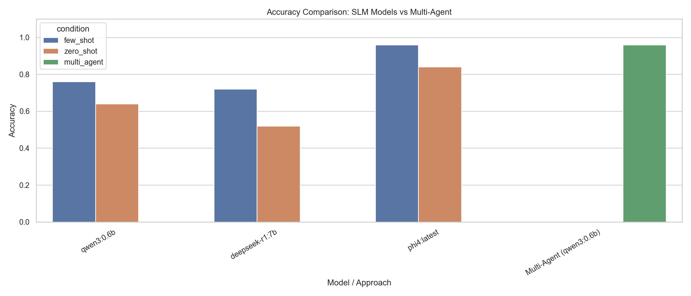
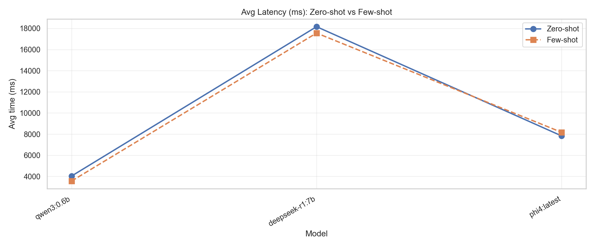
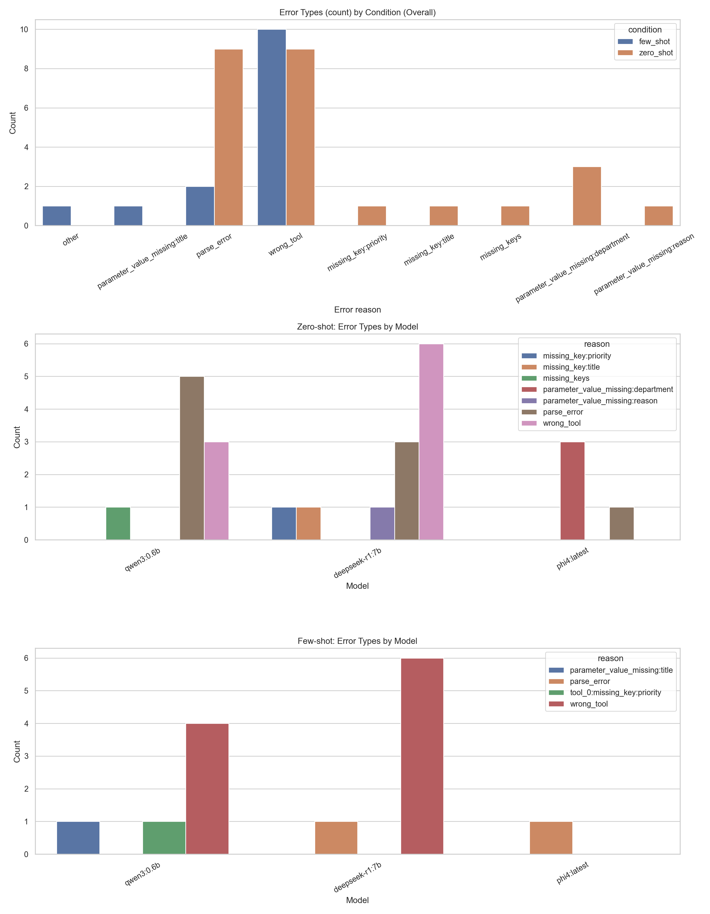

# Tool Calling Results: SLM Models vs Multi-Agent System
Updated: 2026-04-24 00:17:29

## Architecture Comparison

| Approach | Description |
|----------|-------------|
| **SLM (Single Model)** | One model handles all 4 tools with full schema |
| **Multi-Agent** | Router + 4 specialized agents (qwen3:0.6b each) |

## Visualizations

## Accuracy & Timing Comparison

| Model/Approach               | Accuracy   | Avg Time   | Success/Total   | Key Errors                                                                   |
|------------------------------|------------|------------|-----------------|------------------------------------------------------------------------------|
| qwen3:0.6b (ZS)              | 64.0%      | 4034ms     | 16/25           | parse_error:5, wrong_tool:3, missing_keys:1                                  |
| qwen3:0.6b (FS)              | 76.0%      | 3563ms     | 19/25           | wrong_tool:4, tool_0:missing_key:priority:1, parameter_value_missing:title:1 |
| deepseek-r1:7b (ZS)          | 52.0%      | 18160ms    | 13/25           | wrong_tool:6, parse_error:3, missing_key:title:1                             |
| deepseek-r1:7b (FS)          | 72.0%      | 17559ms    | 18/25           | wrong_tool:6, parse_error:1                                                  |
| phi4:latest (ZS)             | 84.0%      | 7834ms     | 21/25           | parameter_value_missing:department:3, parse_error:1                          |
| phi4:latest (FS)             | 96.0%      | 8171ms     | 24/25           | parse_error:1                                                                |
| **Multi-Agent (qwen3:0.6b)** | 96.0%      | 4253ms     | 24/25           | wrong_tool:1                                                                 |

### Multi-Agent Accuracy by Category

| Category        |   Count | Accuracy   |
|-----------------|---------|------------|
| CUSTOMER_QUERY  |       7 | 85.7%      |
| IT_TICKET       |       6 | 100.0%     |
| KNOWLEDGE_QUERY |       6 | 100.0%     |
| LEAVE_REQUEST   |       6 | 100.0%     |

## Error Analysis Summary

| Model                      |   missing_key:priority |   missing_key:title |   missing_keys |   parameter_value_missing:department |   parameter_value_missing:reason |   parameter_value_missing:title |   parse_error |   tool_0:missing_key:priority |   wrong_tool |   Total |
|----------------------------|------------------------|---------------------|----------------|--------------------------------------|----------------------------------|---------------------------------|---------------|-------------------------------|--------------|---------|
| Multi-Agent                |                      0 |                   0 |              0 |                                    0 |                                0 |                               0 |             0 |                             0 |            1 |       1 |
| deepseek-r1:7b (few_shot)  |                      0 |                   0 |              0 |                                    0 |                                0 |                               0 |             1 |                             0 |            6 |       7 |
| deepseek-r1:7b (zero_shot) |                      1 |                   1 |              0 |                                    0 |                                1 |                               0 |             3 |                             0 |            6 |      12 |
| phi4:latest (few_shot)     |                      0 |                   0 |              0 |                                    0 |                                0 |                               0 |             1 |                             0 |            0 |       1 |
| phi4:latest (zero_shot)    |                      0 |                   0 |              0 |                                    3 |                                0 |                               0 |             1 |                             0 |            0 |       4 |
| qwen3:0.6b (few_shot)      |                      0 |                   0 |              0 |                                    0 |                                0 |                               1 |             0 |                             1 |            4 |       6 |
| qwen3:0.6b (zero_shot)     |                      0 |                   0 |              1 |                                    0 |                                0 |                               0 |             5 |                             0 |            3 |       9 |

## Performance Insights

- **Best SLM**: phi4:latest (few_shot) at 96.0% accuracy
- **Multi-Agent**: 96.0% accuracy with 4253ms avg latency

### Why Multi-Agent Works Better

1. **Reduced Cognitive Load**: Each agent only handles 1 tool type
2. **Specialized Prompts**: Domain-specific examples and rules per agent
3. **Explicit Routing**: Router agent makes tool selection a separate, focused decision
4. **Smaller Search Space**: Each agent has fewer valid outputs to consider
